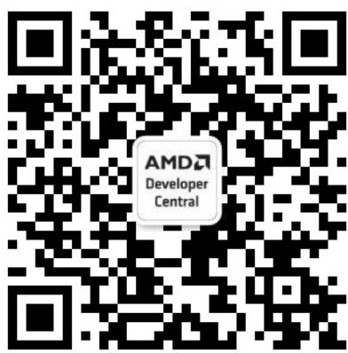
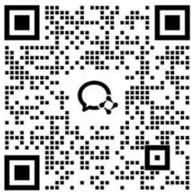
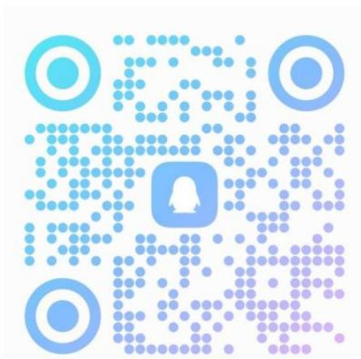

# 第二十一届中国研究生电子设计竞赛 技术类竞赛赛题指南及清单

中国研究生电子设计竞赛技术类竞赛在全国组委会统一管理与统筹下实施，深入贯彻落实国家“十五五”规划关于“加快高水平科技自立自强”、“推动科技创新和产业创新深度融合”的战略部署，立足国家战略需求设置竞赛赛道，分为开放赛道和应用赛道，并附加设立专项赛题，各类赛题说明如下。

## 一、赛道说明

（一）应用赛道由组委会联合高校、企业、地方政府及科研院所等单位，围绕产业应用需求与关键技术问题设立赛题，重点引导学生研究成果与实际应用场景相结合。由命题单位组织评审，评审奖励包括初赛、决赛团队奖与专项奖。

（二）开放赛道由组委会委托竞赛专家委员会，结合电子信息类学科发展方向与研究前沿设立赛题，重点考察参赛队伍的理论基础、技术创新性与工程实现能力。由分赛区承办单位负责组织评审，评审奖励包括初赛、决赛团队奖。

（三）专项赛题作为技术类竞赛的特色赛题，不单独组织报名，仅在参赛团队原赛道（开放/应用赛道）奖励基础上叠加专项奖励。专项赛题围绕特定技术平台、应用领域或产业方向设立，重点考察学生技术深耕能力及成果落地价值。

（四）开放赛道与应用赛道在评审体系、评审对象及获奖名额设置上相互独立，评审结果不互相影响。应用赛道在奖项结构上给予适当政策性引导，以鼓励研究生面向产业需求开展创新实践。

## 二、应用赛道评审办法

（一）应用赛道分为初赛、全国总决赛两个评审阶段。  
（二） 初赛阶段，命题单位依据竞赛统一评审标准，并结合赛题评审要求，评选分赛区初赛团队一、二、三等奖，并推荐不超过赛题报名总数 20% 的队伍晋级全国总决赛，推荐队伍数量不足 6 支的，可根据作品质量适当补足。  
（三）全国总决赛阶段，按全国总决赛晋级队伍数量的 $25\%$ 、 $35\%$ 、 $40\%$ 比例评选全国团队一、二、三等奖。  
（四）应用赛道额外设置专项奖，专项奖的设置原则、数量及奖励方式，由命题单位与组委会协商确定。  
（五）经组委会批准，具备相应组织能力和报名规模的命题单位，可按照竞赛统一规则自主组织全国总决赛评审，获奖队伍受邀参加全国总决赛颁奖仪式。

## 三、开放赛道评审办法说明

（一）开放赛道实行分赛区竞赛和全国总决赛两级评审制度。分赛区竞赛分为初赛、决赛两个阶段，由赛区承办单位负责组织实施；全国总决赛由组委会负责统筹组织工作。  
（二）经分赛区初赛评审，评定分赛区初赛团队一、二、三等奖，并推荐不超过分赛区开放赛道报名总数 $20\%$ 的队伍参加分赛区决赛评审。  
（三）经分赛区决赛评审，部分优秀队伍晋级全国总决赛现场，按全国总决赛晋级队伍数量的 $40\%$ 、 $60\%$ 比例评

选全国团队一等奖和二等奖；未晋级队伍经分赛区评审委员会提名，全国评审委员会认定，授予全国团队三等奖。

（四）华为 6G 先进无线技术探索方向作为开放赛道的一部分，评审标准与开放赛道总体一致，由专家组结合 6G 关键技术指标单独组织初赛评审,具体内容详见《“华为 6G 先进无线技术探索”专向赛参赛说明》。

（五）开放赛道全国总决赛晋级比例与名额动态管理

1. 开放赛道各赛区的全国总决赛决赛晋级名额实行动态管理，结合各赛区报名队伍总数及上届竞赛全国总决赛一、二等奖获奖情况等因素，加权计算、动态分配。  
2. 开放赛道全国总决赛晋级队伍的比例和数量，于报名截止后公布，原则上不超过分赛区开放赛道报名总数的 10%。

## 四、专项赛题评审办法说明

（一）专项赛题分为形式审查与评审奖励两个阶段。  
（二）形式审查阶段，专项赛题专家组对选报作品进行初筛，符合参评条件的优秀团队形成专项奖候选名单。在原赛道中已晋级全国总决赛现场的专项赛选报队伍，优先列入候选名单。  
（三）评审奖励阶段，专家组根据奖项设置数量与评审方式，从候选名单中评选专项奖获奖团队。获奖队伍在原赛道奖项基础上，追加授予专项赛题专项奖及对应奖励。

## 第二十一届中国研究生电子设计竞赛 技术类竞赛赛题指南及清单 目录

## 应用赛道指南与赛题汇总 10

## “兆易创新”命题....11

◆.赛题一：基于兆易创新 GigaDevice 公司的 GD32A7 系列 MCU 的汽车电子控制系统设计....13

$\diamond$ .1. 智能门窗与纹波防夹控制 14  
☆.2. 矩阵 LED 智能前照灯控制 ..... 15  
$\diamond$ .3.UWB数字钥匙与活体检测 15  
$\diamond$ .4. 动力电池热失控预警 16  
☆. 5. ADAS 前向碰撞预警 ..... 16  
☆.6. 自主创新应用场景 …… 16

◆.赛题二：基于兆易创新 GigaDevice 公司产品或相关开发板的 Endpoint AI（边缘 AI）电子系统设计……20

$\diamond$ .1. 音频相关应用 20  
$\star .2.$ 传感器相关应用....20  
$\star .3.$ 工业控制相关应用 20  
$\diamond$ .4. 安防相关应用 20  
$\star .5.$ 边缘计算相关应用 20

◆.赛题三：基于兆易创新 GigaDevice 公司的 GD32G5 系列 MCU 的能源电力系统设计.... 23

$\diamondsuit$ . 1. 直流充电+电池管理系统（BMS）.....23

$\diamond$ .2. 逆变器 23

☆.3. 数字电源....24

◆.赛题四：基于兆易创新 GigaDevice 公司的 GD32H7 系列高性能 MCU 或相关开发板的 GDemWin GUI 设计与开发 27  
◆.赛题五：基于兆易创新“感存算控连”生态的人形 / 工业机器人核心功能系统开发....29

☆.1. 机器人多关节精准协同控制....29  
2. 机器人多模态传感器融合处理 30

◆.赛题六：基于兆易创新多产品线融合的电子系统设计（全开放命题）……32

“华为”命题....39

◆.赛题一：一种人工智能系统中 XPU 电源供电系统的设计 …… 40  
◆.赛题二：卫星天线设计....43  
◆.赛题三：IAT 46  
◆.赛题四：星闪创新应用（智能终端） 51  
◆.赛题五：终端高效宽带射频功放设计 53  
◆.赛题六：低幅度&相位温漂特性的 LNA....55

“小米”命题....60

◆.赛题一：基于 openvela 的分布式互联与协同感知系统....62  
◆.赛题二：近场声音提取与远场抑制 71  
◆.赛题三：面向人车家全生态的智能能源互联系统设计....78  
◆.赛题四：基于 800V 高压平台的宽电压范围高效率车载电源设计....81

◆.赛题五：冰箱食材识别与管理系统....86  
◆.赛题六：轻量级 AI 核心设计 92

## “优利德”命题....99

◆.赛题一：超外差结构窄带频谱仪设计....100  
◆.赛题二：任意波形信号发生器设计....100

## “飞腾”命题....103

◆.赛题一：基于飞腾 CPU 平台的电子系统设计……104  
◆.赛题二：智能模型高效训练....105  
◆.赛题三：智能模型高效推理....107

## “无问芯穹”命题....113

◆.赛题一：端侧/云端协同应用电子设计挑战赛……114  
◆.赛题二：基于 RLinf 的具身智能强化学习挑战赛……115

## “睿创微纳”命题....120

◆.赛题一: 多模态感知融合增强的具身自主抓取任务挑战
122  
◆.赛题二：红外智感—红外开放世界全模态分割挑战……134  
◆.赛题三：具有多模态能力的客服智能体设计 …… 149  
◆.赛题四：“猎鹰·微波智探”—雷达多目标智能探测与识别挑战 162

## “昂科技术”命题....169

◆.通用赛题一：高带宽 PSV 可编程开关矩阵（40 × 60）
系统设计与实现....171  
◆.通用赛题二:高密度 PCBA 探针的亚毫欧级接触电阻智能测试系统....174

◆.挑战赛题三: 多通道亚纳秒级时间数字转换器与延迟校准单元....177  
◆.挑战赛题四：面向微弱电流检测的高精度 SMU 测试系统 …… 179

## “AMD”命题 183

◆.赛题一：基于 AMD 锐龙 AI MAX+ 平台的端侧 AI 智能体与垂直行业创新应用 ……184

$\diamond$ .1. 法律与法务服务....184  
$\star$ .2. 医疗与健康管理....184  
☆.3. 家庭与个人生活 …… 185  
$\Leftrightarrow .4.$ 教育与培训 185

◆.赛题二: 基于 AMD ROCm™ 软件生态与 Radeon 平台的智能算力赋能科研项目设计与实现……195

$\star$ .1.AI科研领域....195  
☆.2.AI应用领域....196

## “TI”命题....203

◆.赛题一：基于 TI C2000 NPU 的边缘智能控制……204  
◆.赛题二：基于 TI 高性能处理器的边缘 AI 应用 …… 205  
◆.赛题三：基于 TI GaN 技术的应用与设计 …… 205  
◆.赛题四：基于 TI 产品技术的自主命题应用 ……206

## “城市具身智能”赛题....210

## 专项赛题汇总 214

## “通感算智融合与数智化应用”专项赛 215

☆.1.AI赋能的通信物理层智能设计与硬件实现……216

$\diamond$ .2.AI赋能的智能传输与资源管理技术 216  
$\diamond$ .3.AI赋能的空天地海智能组网技术 217  
$\star .4.$ AI 赋能的算力网络与自智化技术 217  
$\Leftrightarrow$ 5.AI 赋能的数智化应用与创新 217

## “光载信息”专项赛....221

$\diamond$ .1. 光通信技术 222  
$\star .2.$ 光感知技术 222  
$\Leftrightarrow .3$ 光计算技术 222  
$\diamond$ .4. 光显示技术 222  
$\diamond$ .5. 光健康技术 222  
☆.6. 感/通/算/显/康/照一体化（非全体化）技术……222  
$\diamond$ .7. 空天地海一体化技术 223  
$\diamondsuit$ . 8. 光电元器件模块设计和工艺技术 …… 223  
$\diamond$ .9. 光载信息感知方案算法设计 223

“AI 智能体”专项赛....235  
“Seeed Studio”专项赛 245  
“MathWorks”专项赛 257

## 开放赛道方向说明与参赛指南 260

◆.（一）电路与嵌入式系统类……260  
◆.（二）机电控制与智能制造类....261  
◆.（三）通信与网络技术类……261  
◆.（四）信息感知系统与应用类……261  
◆.（五）信号和信息处理技术与系统……261  
◆.（六）人工智能类....261

$\star .1.$ 方向一：大模型与智能体系统 262  
$\star .2.$ 方向二：具身智能系统 262  
$\Leftrightarrow .3.$ 方向三：人工智能安全 262

◆.（七）技术探索与交叉学科类……262

◆.（八） 华为 6G 先进无线技术探索 ……263

☆. 原生 AI 技术 ..... 267  
$\diamond$ .通感一体技术 267  
$\diamond$ .极致连接技术 267  
☆. 空天地一体化技术 …… 268  
☆. 原生可信技术....268  
☆. 绿色通信技术....268  
☆.系统架构和中射频技术....268

# 第二十一届中国研究生电子设计竞赛 “AMD”命题

## AMD

## 一、公司简介

AMD 成立于 1969 年，总部位于美国加州圣克拉拉（Santa Clara），现已发展为全球领先的高性能与自适应计算公司，全球员工超过 28,000 名（截至 2025 年 3 月）。公司产品涵盖 CPU、GPU、FPGA、DPU 及系统级芯片，并结合强大的软件能力，广泛应用于云端、边缘和终端设备。

AMD 致力于推动人工智能发展, 提供端到端的 AI 训练与推理解决方案, 构建开放生态系统, 并积极与中国生态伙伴合作, 助力产业数字化转型。

中国是 AMD 全球战略的重要市场。自 1993 年进入中国以来，AMD 不断扩大在华投入，业务涵盖产品销售、战略合作、新品开发等。2004 年成立大中华区总部，现由高级副总裁潘晓明领导。

2006 年，AMD 在上海设立研发中心，以上海研发中心为主体的中国研发中心逐渐发展壮大，现已成为全球研发体系的重要组成，拥有超 4,000 名研发人员，覆盖芯片设计、软件开发与系统测试，并与本地客户紧密合作，推动技术落地。近年来，AMD 在 AI 创新与可持续发展方面表现突出，荣获“2023年度杰出可持续创新企业”、“2023-2024年度最受尊敬企业”称号，2024“世界互联网大会杰出贡献奖”等多项荣誉。

## 二、赛题描述

## 赛题一：基于AMD锐龙AI MAX+平台的端侧AI智能体与垂直行业创新应用

搭载 AMD 锐龙 AI Max+395 处理器 Mini AI 工作站，旨在为本地大模型推理、科学计算与垂直行业端侧 AI 解决方案提供更稳定的端侧算力底座选择。

AMD 锐龙 AI Max+395 处理器，该处理器采用创新的 CPU、GPU、NPU 架构，带来强大的异构算力；统一内存架构（UMA）带来的至高 96G 超大显存，基于该处理器的 mini AI 工作站完美契合 MoE 架构大语言模型，同时可兼容并行如机器视觉、自动语音识别、图片理解等多模态模型，为更多的 AI 场景落地提供了全新选择。

\* GPU: 集成 Radeon 8060S GPU（以下简称 GPU）。

本命题要求参赛队伍基于 AMD 锐龙 AI MAX+ 平台，围绕垂直行业的实际需求，设计并实现一个端侧 AI 应用或智能体系统。

行业范围不做严格限制，但鼓励围绕以下重点方向：

1. 法律与法务服务（如智能审合同、法规检索、劳动纠纷辅助分析，法律文书生成等）；  
2. 医疗与健康管理（如影像辅助分析、随访提醒、慢病管理提示等，注意不涉及真实诊断行为）；

3. 家庭与个人生活（如家庭智能管家、家庭安全监控、个人知识管理、儿童教育辅导等）；  
4. 教育与培训（如智能学习助手、课堂分析反馈、个性化练习推荐等）；

同时鼓励团队面向工业、金融、咨询、制造、交通等其他行业提出创新方案，只要能够清晰论证本地部署的必要性（隐私、安全、低延迟、弱网或离线环境等）。

参赛作品应充分发挥 Mini AI 工作站的硬件优势,体现:

1. 本地 AI 推理（数据不出机/不出院/不出企业内网）；  
2. 端到端应用价值（解决具体问题，有可演示的真实流程）；  
3. 对 CPU+GPU+NPU 异构资源和统一内存的合理利用;  
4. 在一定程度上兼顾性能、能效。

## （一）命题前提与开发原则

1. 硬件与平台前提

(1) 推荐硬件平台（示例）：  
① CPU: AMD 锐龙 AI MAX+395  
② GPU: 集成 Radeon 8060S GPU（APU 内置图形单元）  
③ NPU: 锐龙 AI 专用 NPU  
④ 内存: 128GB  
⑤ 存储：2TB SSD  
(2) 访问方式:

报名审核通过后，AMD 将提供基于上述配置的云端开发环境访问方式，具体以技术支持文档说明为准。

① 软件与工具（可选示例）：

1) 操作系统: Windows / Linux;  
2) 深度学习框架：PyTorch、TensorFlow、ONNX Runtime 等；  
3) AMD 官方 AI 硬件加速栈:

Ryzen AI SDK (NPU: https://ryzenai.docs.amd.com)
ROCm 软件栈 (GPU: https://rocm.docs.amd.com)

4) LLM 推理引擎与库（可用于本地部署，部分支持多模态模型）：

vLLM(高性能大语言模型推理引擎, 可通过 ROCm 在 AMD GPU 上加速)

llama.cpp（轻量化本地 LLM 推理库，可在 AMD 平台上利用 CPU / GPU / NPU 等多种后端）

Transformers + accelerate / Text Generation Inference 等（可结合 ROCm / Ryzen AI SDK 使用）本地模型管理与推理工具（主要用于快速体验和应用集成）：

LM Studio（桌面端本地大模型管理与推理工具）

其他同类工具（如 Ollama 等，参赛队伍可自选）

说明：多模态支持取决于所选模型和底层后端，而非单一工具本身。

5) AMD 其余资源介绍: AMD AI Solutions: https://www.amd.com/en/solutions/ai.html

## 2. 开发原则

(1) 本地推理优先:

① 核心模型推理环节应在本地 AMD 平台上完成;  
② 原则上不依赖云端模型推理服务，可允许访问公开网络信息源，但不得上传用户隐私数据；  
③ 若确需调用外部 API，应在技术文档中明确说明原因与数据范围。

(2) 隐私与安全:

① 处理法律、医疗、家庭、教育等敏感行业数据时，应突出本地部署与隐私保护优势；

② 对本地存储的数据（文档、日志、影像等）需有基本的安全设计（如访问控制、必要的加密）。

(3) 端到端应用闭环:

① 不仅要 “跑通模型”，还要实现从用户输入 → 模型推理 → 工具调用 / 结果执行 → 可视化反馈的完整流程；

② 鼓励引入智能体（AI Agent）思想，设计多步任务规划与工具协同。

## （二）任务要求

## 1. 行业场景选择与问题定义

从实际需求出发，选择至少一个垂直行业场景：

(1) 法律：法规检索、合同条款提示、劳动法辅助咨询等（仅提供技术参考，不构成正式法律意见）；

(2) 医疗：影像预分析、病例结构化整理、随访管理等（仅限科研/教学辅助，不得直接用于临床诊断与治疗决策）;  
(3) 家庭：家庭信息助理、家庭安全监控、家庭资产/文档管理等；  
(4) 教育：课堂行为分析、个性化学习建议、错题本管理等；  
(5) 其他行业（工业巡检、金融分析、政务服务等）也可。

明确说明:

(1) 目标用户是谁（律师 / 医生 / 家庭用户 / 教师 / 学生 / 工程师等）；  
(2) 当前痛点是什么;  
(3) 端侧部署的必要性(隐私、弱网、低延迟、合规等)。

## 2. 技术与系统实现要求

(1) 模型与智能体设计:

① 至少使用一个本地部署的 AI 模型（LLM、视觉模型、语音模型、多模态模型等）；  
② 鼓励构建智能体（AI Agent）系统:

具备任务分解、工具调用（如知识库检索、报告生成、外部 API 调用）的能力；

③ 能够完成多步任务（例如法律案例检索 → 提取要点 → 生成结构化报告）。

(2) 硬件利用：必须使用 NPU 或 GPU

① 要求至少有一个核心推理任务在 NPU 或 平台自带 GPU 上执行;  
② 鼓励设计 CPU + GPU + NPU 协同方案，例如:

NPU: 持续在线、低功耗推理（ASR、小模型、Agent 监控逻辑等）；

GPU: 大模型推理、图像/视频处理、向量检索等高吞吐任务;

CPU: 调度、前后处理、逻辑控制。

③ 在技术报告中说明硬件分工与理由。

(3) 性能与精度权衡:

① 可采用量化（INT8/INT4）、蒸馏、剪枝等方法，让模型适配本地环境；  
② 需要给出:

原始模型 vs 本地优化模型的精度对比;

延迟/吞吐/资源占用对比;

③ 说明 “在不同行业任务下，牺牲多大精度换来怎样的本地性能提升”。

## （三）参考方向示例（非强制，供选题时参考）

参赛队伍可参照以下方向进行选题和系统设计，也可提出全新创意：

1. 本地法律助手 / 法务智能体

(1) 面向律师/企业 HR，构建法规/案例知识库；  
(2) 本地 LLM+RAG，完成条款检索、风险提示、劳动纠纷案例分析。

## 2. 医疗影像本地分析系统

(1) 示例：肺结节检测 / 其他部位影像预分析；  
(2) 本地 DICOM 解码、NPU 加速推理、结构化报告草稿生成；  
(3) 突出隐私保护与本地不联网推理。

## 3. 家庭智能管家与电脑管家

(1) 家庭场景: 语音助手、日程提醒、家庭安全检测（摄像头）、儿童时间管理等;  
(2) 电脑场景：系统健康监控、安全风险提示、自动清理与优化策略生成。

## 4. 教育与学习助手

(1) 基于课堂/作业/教材的多模态理解;  
(2) 学生行为分析、错题整理、个性化练习生成与反馈。

## 5. PC 开发者编程助手（Coding Agent）

(1) 在 IDE 中集成本地 Code LLM;  
(2) 利用 NPU+GPU 混合加速，提高 “生成正确代码” 的速度与质量。

## 6. PC 智能体（PC Agent）

(1) 本地部署 LLM，支持语音/文本控制；  
(2) 自动执行打开应用、整理文件、发送邮件、查看系统状态等操作;  
(3) 通过规范化指令与安全约束机制保证可控性。

## 7. 异构资源调度与多任务并发优化

(1) 构建 “代码生成 + 图像生成 + 语音识别” 等多任务并发系统;  
(2) 设计 CPU/GPU/NPU 调度策略，在并发场景下保持各任务性能稳定。

## 8. 基于本地部署 LLM 的工作负载感知电源管理

(1) 传统 PC/服务器的电源管理策略多依赖固定规则或简单的指标阈值（如 CPU 利用率、温度等），难以充分理解复杂、多样的 AI 工作负载。  
(2) 在 Mini AI 工作站 场景下，我们希望利用本地部署的大语言模型（LLM）和其他轻量模型，对当前系统的工作负载、用户场景进行理解和分类，进而智能地调节电源策略（例如 PPKG 参数、功耗上限、Turbo 策略等），在性能和能耗之间取得更合理的折中。

以上方向仅为示例，参赛队伍可按自身研究方向与合作资源自由选题。

## （四）奖项设置

一等奖：奖金：30,000元，获奖名额：1名；  
二等奖：奖金：10,000元，获奖名额：2名；  
三等奖：奖金：3,000元，获奖名额：5名。

## (五) 提交要求

## 1. 初赛阶段

(1) 技术论文（必选，Word/PDF）

内容建议包括但不限于:

① 行业背景与问题定义;

② 系统总体架构;  
③ 模型与智能体设计;  
④ 硬件利用与优化策略（CPU/GPU/NPU、量化等）；  
⑤ 实验与测试结果（性能、精度、能效等）；  
⑥ 行业应用价值与落地分析。

(2) 演示说明 PPT（可选，强烈建议提交）

清晰展示应用场景、关键技术、系统功能与 Demo 流程。

## 2. 决赛阶段

(1) 技术论文（必选，更新完善版）  
(2) 演示说明 PPT（必选）  
(3) 演示视频（必选，建议 3 分钟以内）

展示系统实际运行画面:

① 用户交互流程;  
② 本地推理过程和响应效果;  
③ 资源监控/性能测试片段（如有）。

## （六）评分标准（建议权重，总分 100 分）

## 1. 技术创新与工程实现（35 分）

(1) 模型与系统设计是否有创新点（15 分）；  
(2) 是否有效利用 AMD 锐龙 AI MAX+ 平台硬件特性（NPU/GPU/统一内存等）（10 分）；  
(3) 工程实现的完整性与代码质量、系统架构清晰度（10 分）。

## 2. 行业价值与应用落地潜力（25 分）

(1) 行业痛点分析是否深入, 问题定义是否准确 (10分);  
(2) 方案对法律/医疗/家庭/教育等垂直行业的适配度和扩展性（10 分）；  
(3) 是否已有试点验证 / 用户反馈 / 与企业或单位的合作意向（5 分）。

## 3. 性能、能效（15 分）

(1) 本地推理性能（响应时间、吞吐量等）有定量测量和合理优化（8 分）；  
(2) 能效意识与资源利用（如：量化、模型压缩、NPU/GPU 使用策略等）（7 分）；

## 4. 隐私保护与安全性（15 分）

(1) 是否充分利用本地部署优势保护隐私数据 (7 分);  
(2) 对数据存储、访问控制、日志脱敏等方面的设计（5分）；  
(3) 特别是在法律/医疗/家庭/教育等敏感领域的合规意识与设计（3 分）。

## 5. 文档与展示（10 分）

(1) 技术论文结构清晰、论证严谨，结果分析合理（6分）；  
(2) PPT 与视频演示直观、逻辑清楚，能让评委快速理解作品价值（4 分）。

在总分接近的情况下，优先考虑：

(1) 明确面向法律、医疗、家庭、教育等重点行业，并体现出清晰落地路径的作品；  
(2) 行业应用创新性，如将 LLM 或多模态模型拓展到之前行业没有应用的场景；  
(3) 性能超越业界已有公开方案;  
(4) 已在真实企业/机构/家庭环境中进行过试点或有初步用户反馈的作品;  
(5) 硬件性能的极致使用，能效的综合考虑。

## 赛题二：基于 AMD ROCm™ 软件生态与 Radeon 平台的智能算力赋能科研项目设计与实现

$\mathrm{ROCm}^{\mathrm{TM}}$ 是AMD面向GPU编程的开源软件栈，涵盖驱动、开发工具与API，支持从底层内核到上层应用的全栈开发。ROCm支持桌面端基于 $\mathrm{RDNA}^{\mathrm{TM}}$ 架构的AMD RadeonTM GPU,形成便捷高效的软件开发平台与无缝迁移路径。这一特性有利于在本地完成开发并实现规模化部署，支撑AI工作负载、GPU加速的高性能计算（HPC）、计算机辅助设计（CAD）等应用的开发、测试与落地。

最新的 AMD Radeon™ PRO W 系列显卡采用 RDNA™3 架构的高性能 GPU 核心与 GDDR6 显存，为面向先进 AI 模型与科学计算的本地化、私有化、具成本效益的研发提供坚实算力基础。

本赛题旨在引导参赛队伍基于 AMD ROCm™ 软件生态，依托 AMD Radeon™ PRO W 系列显卡的算力与显存优势，结合真实科研场景与需求，设计与实现“智能算力赋能科研”的项目方案，展示 AMD 的先进硬件与软件生态在实际工作负载中的性能与工程化能力。

## （一）项目领域不做限制，涵盖但不限于：

1. AI 科研领域：人工智能算法研发、生成式与大语言模型（Generative & Large Language Model）的开发与推理、模型部署与框架开发等。

参考示例:

在 ROCm 环境中完成 TileLang 后端适配与验证，使核心算子/内核可在 AMD GPU 上编译运行：

https://github.com/tile-ai/tilelang

2. AI 应用领域：医疗、天文、金融、咨询、制造、教育等行业场景。需明确论证引入 GPU 算力对科研结果或工程效率的必要性与价值。

参考示例:

基于 ROCm 加速的图像修复/去噪/超分辨率等模型助力永乐宫壁画修复与还原, 展示 AMD 算力在文博影像修复中的实际效果与工程可落地性:

https://www.bilibili.com/opus/986966528137101335

## （二）参赛作品应充分利用 ROCm 生态的支持，例如：

1. 框架与架构: 使用 ROCm 支持的深度学习/推理框架（包括但不限于 PyTorch、TensorFlow、vLLM、Llama.cpp 等）。  
2. 库与组件：使用 ROCm 支持的接口与算子库（包括但不限于 Composable Kernel、MIOpen、AITER 等），根据项目需求调用或扩展。  
3. 调优工具: 使用 ROCm 软件栈中的工具进行资源与性能分析、内核与工作负载调优, 实现对 GPU 资源的高效利用。

## （三）在此基础上，鼓励参赛队伍：

1. 对现有软件栈的性能瓶颈进行定位, 提出并实现合理的优化方案。

2. 在项目推进中对当前 ROCm 尚未支持的功能进行补充开发。  
3. 尝试对 ROCm 开源软件栈（详见参考资料）进行代码提交。

## （四）技术支持

## 1. 访问方式:

报名审核通过后，大赛将提供基于上述配置开发环境的远程访问方式，具体以技术支持文档说明为准。  
2. 开发环境示例：（仅供参考，实际环境以实际情况为准。）

(1) 硬件平台:

<table><tr><td>CPU</td><td>AMD EPYCTM 9334 x 2</td></tr><tr><td>GPU</td><td>AMD RadeonTM PRO W Series Graphics Card x 8</td></tr><tr><td>Memory</td><td>64GB x 16</td></tr><tr><td>Disk Space</td><td>3.84T NVMe SSD x 2</td></tr><tr><td>Power Supply</td><td>2700W x 4</td></tr></table>

(2) 软件版本: ROCm 7.1.1

## （五）奖项设置

一等奖：奖金：30,000元，获奖名额：1名；  
二等奖：奖金：10,000元，获奖名额：2名；  
三等奖：奖金：3,000元，获奖名额：5名。

## （六）提交标准

## 1. 技术论文

2. 演示说明 PPT  
3. 演示视频  
4. 工程代码仓库

## (七) 评分标准

1. 项目实现（总分 100 分，含两部分，各 50 分）

(1) 技术论文及 PPT（50 分）

总体要求：行文结构清晰，准确阐述项目目标、实现方案与阶段性成果，重点突出 ROCm 的实际价值与工程可验证性。包含以下几项：

① 项目背景与挑战（10 分）

系统介绍项目背景、拟解决的问题或拟实现的关键功能，并明确项目所面临的技术与工程挑战。

论证引入 AMD 算力/ROCm 软件栈的必要性。

② 方案与实现（15 分）

完整说明数据流程、核心模块设计与关键路径;

明确所用 ROCm 组件（框架、库、工具）及其在项目中的作用与接口关系。

③ 性能与资源分析（15 分）

基于 ROCm 工具开展性能剖析，提供系统化报告，至少包含响应时间（latency）、吞吐量（throughput）、显存占用（VRAM）等指标；

说明测试集与测量方法、展示对硬件资源的合理使用。

④ 阶段性成果与规划（10 分）

给出具数据支撑的阶段性结论，说明当前成果带来的积极作用与影响，并明确后续研究方向与计划。

注：文档可适当使用 AI 辅助，但不应以 AI 生成内容作为提交主体。

(2) 项目开发代码仓库（50 分）

总体要求：仓库结构清晰、文档完备，可在指定环境中稳定复现主要结果，能清晰体现 ROCm 的实际使用。包含以下几项：

① 功能实现与完整性（25 分）

体现对 ROCm 软件栈的调用（如 PyTorch 等框架的 ROCm 适配与调用、ROCm 算子库使用）；

要求核心功能完整，关键实现有合理注释。

② 复现与交付（25 分）

复赛阶段的代码提交须能够复现技术文档中所述核心性能；

要求提供可复现环境（Docker Image）及一键部署/运行脚本；

提供示例输入与期望性能指标及输出结果，必要时附带最小可复现案例。

2. 创新开发（附加分 20 分，含两部分，各 10 分）

(1) 尚未支持功能的开发（10 分）

在充分利用 ROCm 既有能力的基础上，围绕项目需求实现当前尚未支持的功能，涵盖但不限于：新算法的 ROCm后端适配与实现、新算子的开发与调优、新数据类型或量化方式支持、部署框架或上层 API 的 ROCm 适配完善等。

## (2) 性能瓶颈定位与优化（10 分）

在实际工作负载下进行系统化性能分析，明确瓶颈来源与影响路径；提出并实施针对性优化（如内核级优化、算子融合、并行度与流水线设计、显存与带宽优化、异构协同等），以定量指标展示优化效果，并说明对精度、稳定性与工程可维护性的影响。

注: 创新开发部分须提供相关 ROCm 开源代码仓库的合并请求（Pull Request）。

## (八) 参考资料

参赛团队可参考以下开源资源，了解和学习 ROCm。

1. AMD ROCm™ Software Homepage:  
2. https://www.amd.com/zh-cn/products/software/rocm.html  
3. AMD ROCm™ Developer Hub:  
4. https://www.amd.com/en/developer/resources/rocm-hub.html  
5. AMD ROCm™ Documentation: https://rocm.docs.amd.com/en/latest/  
6. Tutorials for AI developers:  
7. https://rocm.docs.amd.com/projects/ai-developer-hub/en/latest/

8. AMD Radeon™ PRO W Series Graphics Card: https://www.amd.com/en/products/graphics/workstations/radeon-pro.html  
9. Getting Started Guide: Using AMD ROCm™ Software on Radeon™ GPUs:

https://www.amd.com/en/developer/resources/ml-radeon.html

10. RocProf (Tool for profiling HIP applications on AMD ROCm platform):  
11. https://rocm.docs.amd.com/projects/rocprofiler/en/latest/how-to/using-rocprof.html  
12. Github ROCm: https://github.com/ROCm  
13. Composable Kernel (CK):  
https://github.com/ROCm/rocm-libraries/tree/develop/projects/composablekernel  
14. HIP (Heterogeneous-computing Interface for Portability):  
15. https://rocm.docs.amd.com/projects/HIP/en/latest/index.html  
16. TheRock (The HIP Environment and ROCm Kit): https://github.com/ROCm/TheRock  
17. MIOpen:
https://rocm.docs.amd.com/projects/MIOpen/en/latest/

## 三、技术支持

关注“AMD 开发者中心”并加入“AMD AI 开发者计划”以获取更多开发者信息：

关注”AMD开发者中心”加入AMD AI开发者计划  

text_image

AMD
Developer
Central

text_image

QR code with a central logo depicting a speech bubble and a brief key, likely for app download or messaging.

https://account.amd.com/en/forms/registration/ai-dev-program.html

赛题交流渠道:  

text_image

QR code with blue and purple dot patterns, featuring a central logo of a white bell icon

AI MAX+平台竞赛沟通 qq 群

text_image

QR code with blue and purple dot patterns, featuring a central logo and text 'BANK'

ROCm™赛题交流 QQ 群